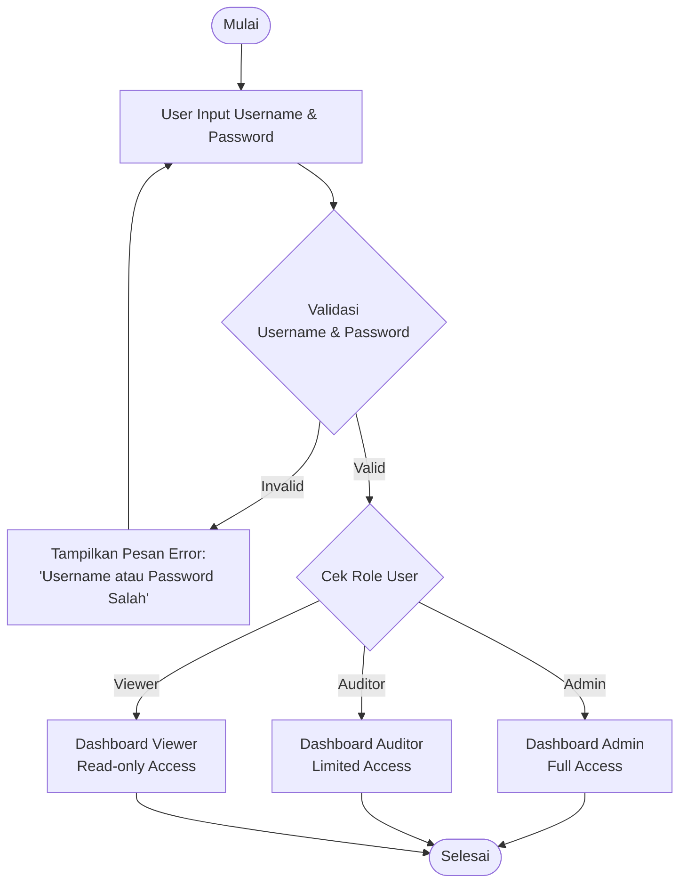
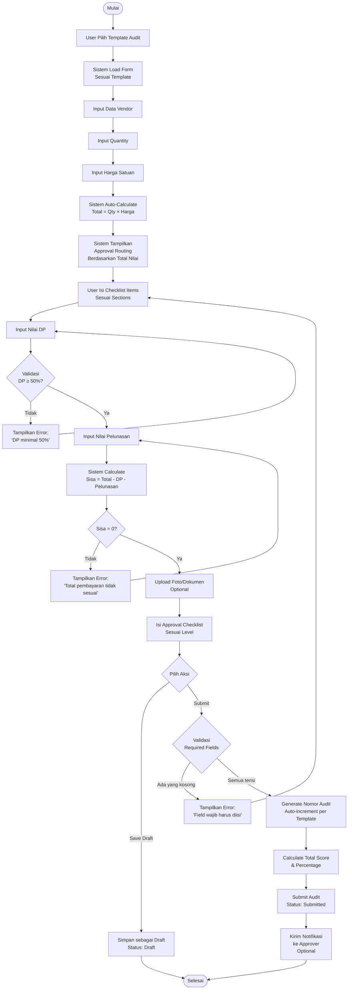
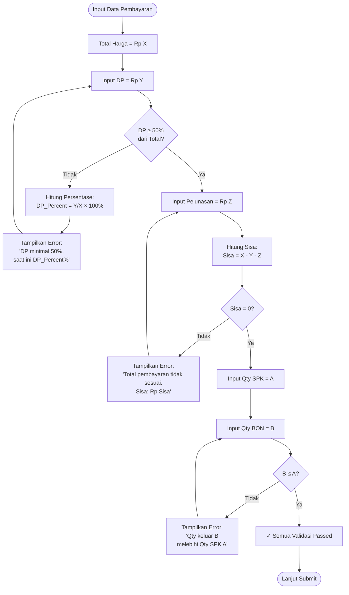
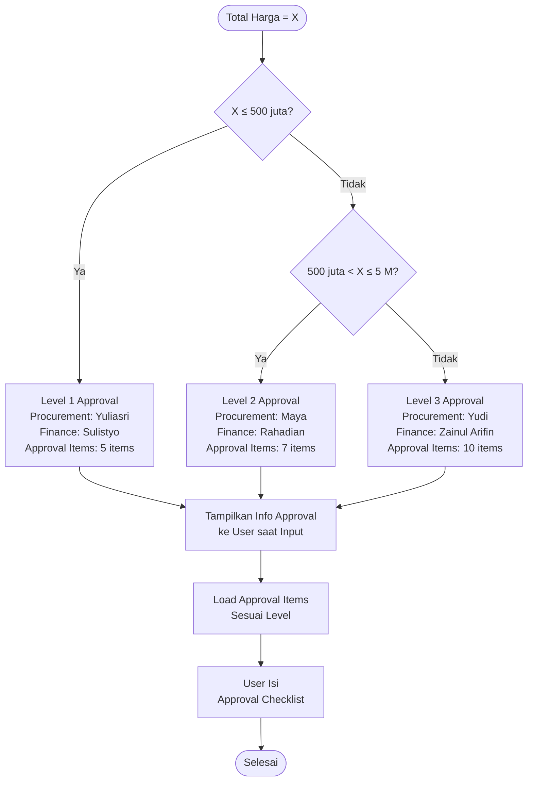
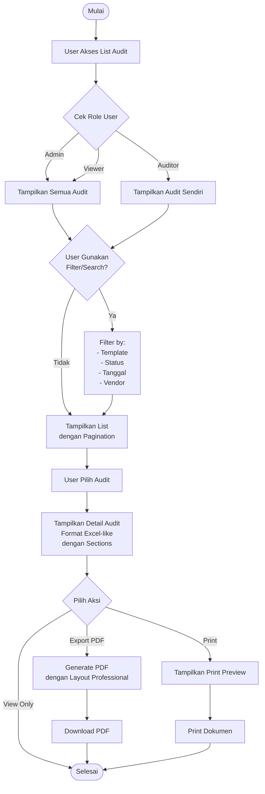
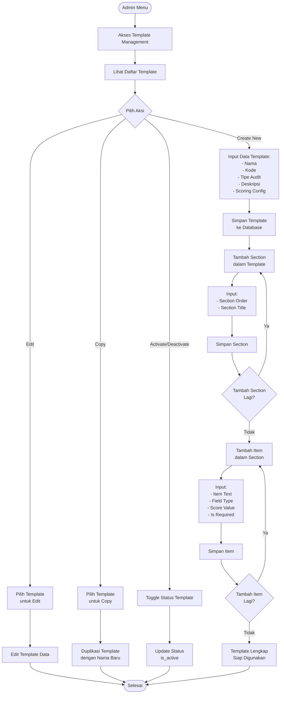

# BAB 4.3 ANALISIS SISTEM SELF AUDIT

Pada tahap analisis sistem, dilakukan penyusunan daftar kebutuhan fungsional sistem, identifikasi data yang perlu disimpan dalam sistem, serta penentuan peran pengguna sistem. Selain itu, disusun juga alur proses self audit dalam bentuk diagram alur (flowchart) untuk menggambarkan proses audit yang berjalan.

---

## 4.3.1 Penyusunan Daftar Kebutuhan Fungsional Sistem

Kebutuhan fungsional sistem adalah fitur-fitur atau fungsi-fungsi yang harus dimiliki oleh sistem untuk memenuhi kebutuhan pengguna dan proses bisnis perusahaan. Kebutuhan fungsional sistem Self Audit dibagi menjadi beberapa modul utama.

### 4.3.1.1 Modul Autentikasi dan Manajemen Pengguna

Modul ini menangani proses login, logout, dan manajemen pengguna sistem.

**Tabel 4.1 Kebutuhan Fungsional Modul Autentikasi**

| No | Kode | Kebutuhan Fungsional | Deskripsi |
|----|------|---------------------|-----------|
| 1 | F-01 | Login Pengguna | Sistem menyediakan halaman login dengan input username dan password. Password disimpan dalam bentuk terenkripsi (hash bcrypt). |
| 2 | F-02 | Validasi Login | Sistem memvalidasi username dan password yang diinput. Jika tidak valid, menampilkan pesan error. |
| 3 | F-03 | Logout Pengguna | Pengguna dapat keluar dari sistem dan session dihapus. |
| 4 | F-04 | Manajemen User (Admin) | Admin dapat menambah, mengubah, dan menonaktifkan pengguna. |
| 5 | F-05 | Reset Password | Admin dapat mereset password pengguna yang lupa. |
| 6 | F-06 | Role-based Access Control | Sistem membatasi akses berdasarkan role pengguna (Admin, Auditor, Viewer). |

**[SCREENSHOT 1: Halaman Login]**
> Ambil screenshot halaman login.php yang menampilkan form username dan password

**[SCREENSHOT 2: Halaman Manajemen User]**
> Ambil screenshot admin/users.php yang menampilkan daftar user dan tombol tambah user

### 4.3.1.2 Modul Dashboard

Modul ini menampilkan informasi ringkasan dan statistik audit.

**Tabel 4.2 Kebutuhan Fungsional Modul Dashboard**

| No | Kode | Kebutuhan Fungsional | Deskripsi |
|----|------|---------------------|-----------|
| 1 | F-07 | Dashboard Overview | Menampilkan statistik: Total Audit, Approved, Pending Review. |
| 2 | F-08 | Recent Submissions | Menampilkan 5 audit terbaru dengan informasi singkat. |
| 3 | F-09 | Quick Action | Menyediakan tombol akses cepat ke fitur Create Audit. |

**[SCREENSHOT 3: Dashboard]**
> Ambil screenshot index.php yang menampilkan dashboard dengan card statistik dan recent submissions

### 4.3.1.3 Modul Template Audit

Modul ini digunakan untuk mengelola template audit (khusus Admin).

**Tabel 4.3 Kebutuhan Fungsional Modul Template Audit**

| No | Kode | Kebutuhan Fungsional | Deskripsi |
|----|------|---------------------|-----------|
| 1 | F-10 | Tambah Template | Admin dapat membuat template audit baru dengan mengisi: Nama Template, Kode Template, Tipe Audit, Deskripsi. |
| 2 | F-11 | Definisi Section | Admin dapat menambahkan section dalam template untuk grouping checklist items. |
| 3 | F-12 | Definisi Item Checklist | Admin dapat menambahkan item checklist dengan berbagai tipe field: checkbox, radio, text, number, date, textarea, select. |
| 4 | F-13 | Konfigurasi Scoring | Admin dapat mengatur nilai score untuk setiap item dan maksimal score template. |
| 5 | F-14 | Edit Template | Admin dapat mengubah template yang sudah ada. |
| 6 | F-15 | Copy Template | Admin dapat menduplikasi template untuk membuat template baru yang serupa. |
| 7 | F-16 | Aktifkan/Nonaktifkan Template | Admin dapat mengaktifkan atau menonaktifkan template tanpa menghapus. |
| 8 | F-17 | Lihat Daftar Template | Menampilkan semua template dengan informasi: Nama, Kode, Tipe, Status Aktif. |

**[SCREENSHOT 4: Daftar Template]**
> Ambil screenshot admin/templates.php yang menampilkan daftar template audit

**[SCREENSHOT 5: Form Tambah Template]**
> Ambil screenshot form create template dengan field-field yang ada

### 4.3.1.4 Modul Approval Rules

Modul ini mengelola aturan approval berdasarkan nilai transaksi (khusus Admin).

**Tabel 4.4 Kebutuhan Fungsional Modul Approval Rules**

| No | Kode | Kebutuhan Fungsional | Deskripsi |
|----|------|---------------------|-----------|
| 1 | F-18 | Definisi Rule Approval | Admin dapat membuat rule: IF nilai transaksi [operator] [value] THEN approval oleh [nama approver]. |
| 2 | F-19 | Multi-level Approval | Sistem mendukung 3 level approval: Level 1 (Manager), Level 2 (GM), Level 3 (Director). |
| 3 | F-20 | Kategori Approval | Setiap level memiliki 2 kategori approver: Procurement dan Finance. |
| 4 | F-21 | Operator Kondisi | Mendukung operator: ≤ (kurang dari sama dengan), > (lebih dari), between (antara). |
| 5 | F-22 | Edit Rule | Admin dapat mengubah rule approval yang sudah ada. |
| 6 | F-23 | Aktifkan/Nonaktifkan Rule | Admin dapat mengaktifkan atau menonaktifkan rule. |

**[SCREENSHOT 6: Approval Rules]**
> Ambil screenshot halaman approval rules yang menampilkan daftar rules dengan kondisi nilai

### 4.3.1.5 Modul Audit Submission

Modul ini adalah modul utama untuk pengisian form audit oleh Auditor.

**Tabel 4.5 Kebutuhan Fungsional Modul Audit Submission**

| No | Kode | Kebutuhan Fungsional | Deskripsi |
|----|------|---------------------|-----------|
| 1 | F-24 | Pilih Template Audit | User memilih template audit dari list template yang aktif. |
| 2 | F-25 | Input Data Vendor | User mengisi: Nama Vendor, Lokasi Unit, data vendor lainnya. |
| 3 | F-26 | Input Data Transaksi | User mengisi: Quantity, Harga Satuan. |
| 4 | F-27 | Auto-Calculate Total Harga | Sistem otomatis menghitung: Total = Quantity × Harga Satuan. |
| 5 | F-28 | Tampil Approval Routing | Sistem otomatis menampilkan approver yang diperlukan berdasarkan total nilai. |
| 6 | F-29 | Input Data Pembayaran | User mengisi: Nilai DP, Nilai Pelunasan. |
| 7 | F-30 | Validasi DP 50% | Sistem validasi: DP ≥ 50% dari total. Tampilkan error jika tidak memenuhi. |
| 8 | F-31 | Validasi Pelunasan | Sistem validasi: DP + Pelunasan = Total (Sisa = 0). Tampilkan error jika ada sisa. |
| 9 | F-32 | Validasi Quantity | Sistem validasi: Qty BON ≤ Qty SPK. Tampilkan error jika melebihi. |
| 10 | F-33 | Upload Foto/Dokumen | User dapat upload multiple file (foto/PDF) maksimal 10MB per file. |
| 11 | F-34 | Save Draft | User dapat menyimpan draft untuk dilanjutkan kemudian. Status: Draft. |
| 12 | F-35 | Submit Audit | User submit audit. Status berubah menjadi Submitted. Generate nomor audit otomatis. |
| 13 | F-36 | Auto-Scoring | Sistem menghitung total score dan persentase berdasarkan checklist yang diisi. |
| 14 | F-37 | Generate Nomor Audit | Sistem generate nomor audit otomatis per template (auto-increment). Format: {TEMPLATE_CODE}-{NUMBER}. |
| 15 | F-38 | Conditional Validation | Jika user pilih "Ada" pada radio button, maka field tanggal menjadi required. |

**[SCREENSHOT 7: Pilih Template Audit]**
> Ambil screenshot audit/select_type.php yang menampilkan pilihan template audit

**[SCREENSHOT 8: Form Audit - Bagian Header]**
> Ambil screenshot bagian atas form audit/create.php yang menampilkan input vendor, quantity, harga

**[SCREENSHOT 9: Form Audit - Auto Calculate]**
> Ambil screenshot saat total harga ter-calculate otomatis setelah input qty dan harga satuan

**[SCREENSHOT 10: Form Audit - Approval Routing]**
> Ambil screenshot bagian yang menampilkan informasi approval routing otomatis berdasarkan nilai

**[SCREENSHOT 11: Form Audit - Validasi DP]**
> Ambil screenshot error message saat DP kurang dari 50%

**[SCREENSHOT 12: Form Audit - Upload Foto]**
> Ambil screenshot bagian upload multiple foto/dokumen

### 4.3.1.6 Modul View dan Export Audit

Modul ini untuk melihat dan mengekspor data audit.

**Tabel 4.6 Kebutuhan Fungsional Modul View dan Export**

| No | Kode | Kebutuhan Fungsional | Deskripsi |
|----|------|---------------------|-----------|
| 1 | F-39 | List Audit | Menampilkan daftar semua audit dengan informasi: Nomor, Template, Vendor, Tanggal, Status, Total. |
| 2 | F-40 | Filter Audit | User dapat filter audit berdasarkan: Template, Status, Tanggal. |
| 3 | F-41 | Search Audit | User dapat mencari audit berdasarkan: Nomor Audit, Nama Vendor. |
| 4 | F-42 | View Detail Audit | User dapat melihat detail lengkap audit dalam format Excel-like dengan sections. |
| 5 | F-43 | Export ke PDF | User dapat mengekspor audit ke format PDF untuk cetak atau share. |
| 6 | F-44 | Lihat Foto Upload | User dapat melihat preview foto/dokumen yang telah diupload. |
| 7 | F-45 | Pagination | Daftar audit menggunakan pagination (20 items per halaman). |

#### Detail Fitur Filter Audit (F-40)

Fitur filter audit memungkinkan user untuk menyaring daftar audit berdasarkan kriteria tertentu agar lebih mudah menemukan data yang dibutuhkan.

**Tabel 4.6a Detail Fitur Filter Audit**

| No | Jenis Filter | Deskripsi | Tipe Input |
|----|--------------|-----------|------------|
| 1 | Filter Template | User dapat memilih satu atau lebih template audit untuk ditampilkan. Menampilkan dropdown berisi semua template yang tersedia. | Dropdown/Select (Multiple) |
| 2 | Filter Status | User dapat memilih status audit: Draft, Submitted, Reviewed, Approved, Rejected, atau All. Default: All (menampilkan semua status). | Dropdown/Select |
| 3 | Filter Tanggal | User dapat filter berdasarkan rentang tanggal submission. Input: Dari Tanggal (From Date) dan Sampai Tanggal (To Date). | Date Range Picker |
| 4 | Kombinasi Filter | Sistem mendukung kombinasi multiple filter. Contoh: Template A + Status Approved + Tanggal bulan ini. | Combined Filters |
| 5 | Reset Filter | Tombol "Reset" untuk menghapus semua filter dan kembali menampilkan semua audit. | Button |
| 6 | Filter Counter | Menampilkan jumlah hasil yang ditemukan setelah filter diterapkan. Contoh: "Menampilkan 15 dari 150 audit". | Display Label |

**Contoh Penggunaan Filter:**

1. **Filter by Template:**
   - User memilih "Template Mix Oil" dari dropdown
   - Sistem menampilkan hanya audit dengan template Mix Oil

2. **Filter by Status:**
   - User memilih "Approved" dari dropdown status
   - Sistem menampilkan hanya audit yang sudah disetujui

3. **Filter by Tanggal:**
   - User input: From Date: 01/01/2026, To Date: 31/01/2026
   - Sistem menampilkan audit yang dibuat di bulan Januari 2026

4. **Kombinasi Filter:**
   - Template: "Vendor Evaluation"
   - Status: "Submitted"
   - Tanggal: "Minggu ini"
   - Sistem menampilkan audit Vendor Evaluation yang berstatus Submitted yang dibuat minggu ini

#### Detail Fitur Search Audit (F-41)

Fitur search audit memungkinkan user untuk mencari audit secara cepat berdasarkan nomor audit atau nama vendor.

**Tabel 4.6b Detail Fitur Search Audit**

| No | Aspek Search | Deskripsi | Implementasi |
|----|--------------|-----------|--------------|
| 1 | Search Input | Input text box dengan placeholder "Cari berdasarkan Nomor Audit atau Nama Vendor...". Icon search di sebelah kiri input. | Text Input dengan Icon |
| 2 | Search by Nomor Audit | User dapat mencari dengan mengetikkan nomor audit. Format pencarian: MIX_OIL-00001, BARBES-00005, dll. Pencarian bersifat partial match (mengandung kata kunci). | LIKE Query pada nomor audit |
| 3 | Search by Nama Vendor | User dapat mencari dengan mengetikkan nama vendor/seller. Contoh: "PT ABC", "Toko", "Supplier". Pencarian bersifat case-insensitive dan partial match. | LIKE Query pada seller_name |
| 4 | Combined Search | Satu input box untuk mencari nomor audit ATAU nama vendor. Sistem otomatis mencari di kedua field sekaligus dengan operator OR. | OR Logic dalam Query |
| 5 | Preserve Filters | Saat melakukan search, filter yang sudah diterapkan (Template, Status, Tanggal) tetap aktif. Search bekerja sebagai filter tambahan. | Hidden Input Parameters |
| 6 | Clear Search | Tombol "Hapus Pencarian" muncul saat search aktif untuk menghapus kata kunci search sambil mempertahankan filter lainnya. | Dynamic Button |
| 7 | Search Indicator | Menampilkan badge/label yang menunjukkan kata kunci pencarian yang aktif. Contoh: "Hasil pencarian untuk: 'MIX_OIL'". | Visual Feedback |
| 8 | Real-time Filtering | Hasil search menampilkan hanya kategori template yang memiliki hasil. Template tanpa hasil tidak ditampilkan. | Conditional Display |

**Contoh Penggunaan Search:**

1. **Search by Nomor Audit:**
   - User ketik: "MIX_OIL-00001"
   - Sistem menampilkan audit dengan nomor yang mengandung "MIX_OIL-00001"

2. **Search by Partial Nomor:**
   - User ketik: "00001"
   - Sistem menampilkan semua audit dengan nomor yang mengandung "00001" dari semua template

3. **Search by Nama Vendor:**
   - User ketik: "PT ABC"
   - Sistem menampilkan semua audit yang vendor/seller-nya mengandung "PT ABC"

4. **Search by Keyword:**
   - User ketik: "Toko"
   - Sistem menampilkan semua audit dari vendor yang mengandung kata "Toko"

5. **Combined Search & Filter:**
   - User select Template: "Self Audit : Jual Beli Mix Oil"
   - User select Status: "Approved"
   - User search: "PT ABC"
   - Sistem menampilkan audit Mix Oil yang Approved dengan vendor PT ABC

**Interaksi Search dan Filter:**

Search dan Filter dapat digunakan bersamaan untuk pencarian yang lebih spesifik:

- **Search + Template Filter**: Mencari dalam template tertentu saja
- **Search + Status Filter**: Mencari audit dengan status tertentu saja
- **Search + Date Range**: Mencari dalam rentang tanggal tertentu
- **Search + Multiple Filters**: Kombinasi semua filter untuk pencarian sangat spesifik

**[SCREENSHOT 13: List Audit]**
> Ambil screenshot audit/list.php yang menampilkan daftar audit dengan filter dan search

**[SCREENSHOT 14: View Detail Audit]**
> Ambil screenshot audit/view.php yang menampilkan detail audit dalam format Excel-like

**[SCREENSHOT 15: Export PDF]**
> Ambil screenshot hasil export PDF atau tampilan saat generate PDF

### 4.3.1.7 Rangkuman Kebutuhan Fungsional

Berdasarkan analisis di atas, sistem Self Audit memiliki **total 45 kebutuhan fungsional** yang terbagi dalam 7 modul utama:

| Modul | Jumlah Kebutuhan | Prioritas |
|-------|------------------|-----------|
| Autentikasi dan Manajemen Pengguna | 6 | High |
| Dashboard | 3 | Medium |
| Template Audit | 8 | High |
| Approval Rules | 6 | High |
| Audit Submission | 15 | High |
| View dan Export | 7 | High |
| **TOTAL** | **45** | - |

---

## 4.3.2 Identifikasi Data yang Perlu Disimpan

Data yang perlu disimpan dalam sistem diidentifikasi berdasarkan kebutuhan proses bisnis dan kebutuhan fungsional sistem. Data-data tersebut disimpan dalam database dengan struktur yang telah dirancang.

### 4.3.2.1 Entitas Data Utama

Sistem Self Audit memiliki 9 (sembilan) entitas data utama yang perlu disimpan:

**Tabel 4.7 Entitas Data Sistem Self Audit**

| No | Nama Entitas | Deskripsi | Jumlah Atribut |
|----|--------------|-----------|----------------|
| 1 | users | Menyimpan data pengguna sistem | 8 |
| 2 | audit_templates | Menyimpan master template audit | 11 |
| 3 | template_sections | Menyimpan bagian/section dalam template | 4 |
| 4 | template_items | Menyimpan item checklist dalam section | 8 |
| 5 | audit_submissions | Menyimpan data submission audit | 15 |
| 6 | audit_responses | Menyimpan jawaban checklist audit | 5 |
| 7 | approval_rules | Menyimpan aturan approval | 9 |
| 8 | approval_items | Menyimpan item checklist approval | 6 |
| 9 | po_info | Menyimpan informasi Purchase Order | 10 |

### 4.3.2.2 Detail Struktur Data

Detail struktur data untuk setiap entitas ditampilkan melalui screenshot dari phpMyAdmin yang menunjukkan struktur tabel actual dari database sistem.

#### A. Entitas: users

Menyimpan data pengguna yang dapat mengakses sistem dengan role-based access control.

**[SCREENSHOT 18: Struktur Tabel users]**
> **Cara Ambil Screenshot:**
> 1. Buka phpMyAdmin: `http://localhost/phpmyadmin`
> 2. Pilih database: `audit_system`
> 3. Klik tabel: `users`
> 4. Klik tab: **"Structure"** atau **"Struktur"**
> 5. Screenshot bagian struktur tabel yang menampilkan semua field
> 6. Pastikan terlihat: Field Name, Type, Length/Values, Null, Key, Default, Extra

**Field Utama:**
- **id**: Primary Key (INT, Auto Increment)
- **username**: Username login (VARCHAR 50, UNIQUE)
- **password**: Password ter-hash bcrypt (VARCHAR 255)
- **full_name**: Nama lengkap user (VARCHAR 100)
- **email**: Email user (VARCHAR 100)
- **role**: Role user - 'admin', 'auditor', atau 'viewer' (ENUM)
- **created_at**: Timestamp pembuatan (TIMESTAMP)
- **updated_at**: Timestamp update terakhir (TIMESTAMP)

**[SCREENSHOT 19: Sample Data Tabel users]**
> **Cara Ambil Screenshot:**
> 1. Di tabel `users`, klik tab: **"Browse"** atau **"Jelajah"**
> 2. Screenshot yang menampilkan minimal 3 user dengan role berbeda
> 3. Pastikan terlihat: username, full_name, email, role (password boleh ter-truncate)
> 
> **Data yang Harus Ada:**
> - 1 user dengan role: admin
> - 1 user dengan role: auditor
> - 1 user dengan role: viewer

#### B. Entitas: audit_templates

Menyimpan master template audit yang dapat dikustomisasi oleh admin.

**[SCREENSHOT 20: Struktur Tabel audit_templates]**
> **Cara Ambil Screenshot:**
> 1. Di phpMyAdmin, klik tabel: `audit_templates`
> 2. Klik tab: **"Structure"**
> 3. Screenshot struktur lengkap yang menampilkan 11 field
> 4. Highlight atau tandai field `created_by` yang merupakan Foreign Key ke tabel `users`

**Field Utama:**
- **id**: Primary Key (INT, Auto Increment)
- **template_name**: Nama template (VARCHAR 100)
- **template_code**: Kode unik template (VARCHAR 50, UNIQUE)
- **audit_type**: Jenis audit - 'mix_oil', 'vendor_evaluation', dll (ENUM)
- **description**: Deskripsi template (TEXT)
- **scoring_enabled**: Flag enable scoring (TINYINT 1)
- **max_score**: Score maksimal (INT, default 100)
- **is_active**: Status aktif template (TINYINT 1)
- **created_by**: User yang membuat (INT, FK ke users.id)
- **created_at**, **updated_at**: Timestamp (TIMESTAMP)

**[SCREENSHOT 21: Sample Data Tabel audit_templates]**
> **Cara Ambil Screenshot:**
> 1. Klik tab: **"Browse"**
> 2. Screenshot yang menampilkan minimal 1-2 template
> 3. Pastikan terlihat: template_name, template_code, audit_type, is_active

#### C. Entitas: template_sections

Menyimpan section/bagian dalam template untuk grouping checklist items.

**Tabel 4.10 Struktur Data Entitas template_sections**

| No | Nama Field | Tipe Data | Ukuran | Keterangan |
|----|------------|-----------|--------|------------|
| 1 | id | INT | - | Primary Key, Auto Increment |
| 2 | template_id | INT | - | Foreign Key ke audit_templates.id |
| [SCREENSHOT 22: Struktur Tabel template_sections]**
> **Cara Ambil Screenshot:**
> 1. Klik tabel: `template_sections`
> 2. Tab: **"Structure"**
> 3. Screenshot yang menampilkan 4 field
> 4. Tandai field `template_id` sebagai Foreign Key

**Field Utama:**
- **id**: Primary Key (INT, Auto Increment)
- **template_id**: ID template (INT, FK ke audit_templates.id)
- **section_order**: Urutan section (INT)
- **section_title**: Judul section (VARCHAR 200)

**Contoh Section:** input.

**[SCREENSHOT 23: Struktur Tabel template_items]**
> **Cara Ambil Screenshot:**
> 1. Klik tabel: `template_items`
> 2. Tab: **"Structure"**
> 3. Screenshot yang menampilkan 8 field
> 4. Pastikan field_type ENUM terlihat jelas dengan value-nya

**Field Utama:**
- **id**: Primary Key (INT, Auto Increment)
- **section_id**: ID section (INT, FK ke template_sections.id)
- **item_order**: Urutan item dalam section (INT)
- **item_text**: Teks pertanyaan checklist (TEXT)
- **field_type**: Tipe input - 'checkbox', 'radio', 'text', 'number', 'date', 'textarea', 'select' (ENUM)
- **field_options**: Options untuk radio/select dalam format JSON (TEXT)
- **score_value**: Nilai score item (INT)
- **is_required**: Flag wajib diisi (TINYINT 1)

**[SCREENSHOT 24: Sample Data template_items dengan Berbagai Field Type]**
> **Cara Ambil Screenshot:**
> 1. Tab: **"Browse"**
> 2. Filter atau cari items dengan field_type berbeda
> 3. Screenshot yang menampilkan minimal 3-4 items dengan field_type: checkbox, text, date, numberre_value: 10
is_required: 1
```

#### E. Entitas: audit_submissions

Menyimpan data submission audit yang dibuat oleh auditor (tabel utama/inti sistem).

**[SCREENSHOT 25: Struktur Tabel audit_submissions - Part 1]**
> **Cara Ambil Screenshot:**
> 1. Klik tabel: `audit_submissions`
> 2. Tab: **"Structure"**
> 3. Screenshot bagian atas struktur (field 1-8)
> 4. Pastikan terlihat: id, template_id, audit_number, submitted_by (FK)

**[SCREENSHOT 26: Struktur Tabel audit_submissions - Part 2]**
> **Cara Ambil Screenshot:**
> 1. Scroll ke bawah struktur tabel yang sama
> 2. Screenshot bagian bawah (field 9-15)
> 3. Pastikan terlihat: status ENUM dengan value-nya

**Field Utama:**
- **id**: Primary Key (INT, Auto Increment)
- **template_id**: Template yang digunakan (INT, FK)
- **audit_number**: Nomor audit per template (INT, auto-increment)
- **submitted_by**: User pembuat (INT, FK ke users.id)
- **submission_date**: Tanggal submission (DATE)
- **seller_name**: Nama vendor/penjual (VARCHAR 100)
- **quantity**: Jumlah barang (VARCHAR 50)
- **unit_price**: Harga satuan (VARCHAR 50)
- **total_price**: Total harga = qty × harga (VARCHAR 50)
- **total_score**: Total score audit (INT)
- **percentage_score**: Persentase score (DECIMAL 5,2)
- **status**: Status audit - 'draft', 'submitted', 'reviewed', 'approved', 'rejected' (ENUM)
- **auto_status**: Info approval routing otomatis (VARCHAR 50)
- **notes**: Catatan tambahan (TEXT)
- **created_at**, **updated_at**: Timestamp (TIMESTAMP)

**[SCREENSHOT 27: Sample Data audit_submissions]**
> **Cara Ambil Screenshot:**
> 1. Tab: **"Browse"**
> 2. Screenshot yang menampilkan 2-3 audit submissions
> 3. Pastikan terlihat: audit_number, seller_name, total_price, status

#### F. Entitas: audit_responses

Menyimpan jawaban/response untuk setiap item dalam audit submission.

**Tabel 4.13 Struktur Data Entitas audit_responses**
checklist dalam audit submission.

**[SCREENSHOT 28: Struktur Tabel audit_responses]**
> **Cara Ambil Screenshot:**
> 1. Klik tabel: `audit_responses`
> 2. Tab: **"Structure"**
> 3. Screenshot yang menampilkan 5 field
> 4. Tandai 2 Foreign Keys: submission_id dan item_id

**Field Utama:**
- **id**: Primary Key (INT, Auto Increment)
- **submission_id**: ID audit submission (INT, FK ke audit_submissions.id)
- **item_id**: ID item template (INT, FK ke template_items.id)
- **response_value**: Nilai jawaban user (TEXT) - bisa 'checked', text, number, dll
- **response_date**: Tanggal untuk field type date (DATE, optional)

**Relasi:** Satu audit submission memiliki banyak responses (1:N)
Menyimpan rule approval routing berdasarkan nilai transaksi.

**Tabel 4.14 Struktur Data Entitas approval_rules**

| No | Nama Field | Tipe Data | Ukuran | Keterangan |
|----|------------|-----------|--------|------------|
| 1 | id | INT | - | Primary Keyotomatis berdasarkan nilai transaksi.

**[SCREENSHOT 29: Struktur Tabel approval_rules]**
> **Cara Ambil Screenshot:**
> 1. Klik tabel: `approval_rules`
> 2. Tab: **"Structure"**
> 3. Screenshot yang menampilkan 9 field

**Field Utama:**
- **id**: Primary Key (INT, Auto Increment)
- **template_id**: Template terkait (INT, FK ke audit_templates.id)
- **rule_name**: Nama rule (VARCHAR 100)
- **required_approval**: Nama approver (VARCHAR 200)
- **approval_category**: Kategori - 'Procurement' atau 'Finance' (VARCHAR 50)
- **condition_operator**: Operator kondisi - '<=', '<', '>', 'between' (VARCHAR 20)
- **condition_value**: Nilai threshold (VARCHAR 50)
- **approval_level**: Level 1, 2, atau 3 (INT)
- **is_active**: Status aktif rule (TINYINT 1)

**[SCREENSHOT 30: Sample Data approval_rules dengan 3 Level]**
> **Cara Ambil Screenshot:**
> 1. Tab: **"Browse"**
> 2. Screenshot yang menampilkan minimal 6 rules (2 kategori × 3 level)
> 3. Pastikan terlihat perbedaan approval_level dan condition_valueabel 4.15 Struktur Data Entitas approval_items**

| No | Nama Field | Tipe Data | Ukuran | Keterangan |
|----|------------|-----------|--------|------------|
| 1 | id | INT | - | Primary Key, Auto Increment |
| 2 | template_id | INT | - | Foreign Key ke audit_templates.id |
| 3 | item_name | VARCHAR | 200 | Nama item approval |
| 4 | item_order | INT | - | Urutan item |
| 5 | required_for_level | INT | - | Remuncul dinamis berdasarkan level.

**[SCREENSHOT 31: Struktur Tabel approval_items]**
> **Cara Ambil Screenshot:**
> 1. Klik tabel: `approval_items`
> 2. Tab: **"Structure"**
> 3. Screenshot yang menampilkan 6 field

**Field Utama:**
- **id**: Primary Key (INT, Auto Increment)
- **template_id**: Template terkait (INT, FK ke audit_templates.id)
- **item_name**: Nama item approval checklist (VARCHAR 200)
- **item_order**: Urutan item (INT)
- **required_for_level**: Required untuk level 1, 2, atau 3 (INT)
- **is_active**: Status aktif item (TINYINT 1)

**Konsep:** 
- Level 1: 5 items (basic checks)
- Level 2: 7 items (Level 1 + 2 items tambahan)
- Level 3: 10 items (Level 2 + 3 items tambahan) | id | INT | - | Primary Key, Auto Increment |
| 2 | submission_id | INT | - | Foreign Key ke audit_submissions.id |
| 3 | po_number | VARCHAR | 50 | Nomor PO |
| 4 | po_date | DATE | - | Tanggal PO |
| 5 | supplier_name | VARCHAR | 100 | Nama supplier |
| 6 | description | TEXT | - | Deskripsi PO |
| 7 | amount | DECIMAL | 15,2 | Nil(PO) terkait audit submission (optional).

**[SCREENSHOT 32: Struktur Tabel po_info]**
> **Cara Ambil Screenshot:**
> 1. Klik tabel: `po_info`
> 2. Tab: **"Structure"**
> 3. Screenshot yang menampilkan 10 field
> 4. Tandai field submission_id sebagai Foreign Key

**Field Utama:**
- **id**: Primary Key (INT, Auto Increment)
- **submission_id**: ID audit terkait (INT, FK ke audit_submissions.id)
- **po_number**: Nomor Purchase Order (VARCHAR 50)
- **po_date**: Tanggal PO (DATE)
- **supplier_name**: Nama supplier (VARCHAR 100)
- **description**: Deskripsi PO (TEXT)
- **amount**: Nilai PO (DECIMAL 15,2)
- **payment_terms**: Syarat pembayaran (VARCHAR 100)
- **delivery_date**: Tanggal pengiriman (DATE)
- **notes**: Catatan tambahan (TEXT)

**Relasi:** Satu audit submission dapat memiliki satu PO info (1:1, optional)sections
                    │         │
                    │         └──> (*) template_items
                    │                     │
                    │                     │
                    ├──> (*) approval_rules
                    │
                    └──> (*) approval_items

audit_submissions (1) ──> (*) audit_responses
                    │
                    └──> (1) po_info
```

**Penjelasan Relasi:**
- Satu user dapat membuat banyak audit_submissions (1:N)
- Satu user dapat membuat banyak audit_templates (1:N)
- Satu template memiliki banyak sections (1:N)
- Satu section memiliki banyak items (1:N)
- Satu template memiliki banyak approval_rules (1:N)
- Satu template memiliki banyak approval_items (1:N)
- Satu audit_submission memiliki banyak audit_responses (1:N)
- Satu audit_submission memiliki satu po_info (1:1, optional)

**[SCREENSHOT 16: Database Schema]**
> Ambil screenshot dari phpMyAdmin yang menampilkan daftar tabel database atau struktur database

---

## 4.3.3 Penentuan Peran Pengguna Sistem
33: Daftar Semua Tabel Database]**
> **Cara Ambil Screenshot:**
> 1. Di phpMyAdmin, pastikan database `audit_system` terpilih
> 2. Tampilan akan menunjukkan list semua tabel (9 tabel)
> 3. Screenshot yang menampilkan semua tabel dengan info jumlah rows
> 4. Pastikan terlihat: users, audit_templates, template_sections, template_items, audit_submissions, audit_responses, approval_rules, approval_items, po_info

**[SCREENSHOT 34: ERD atau Relasi Antar Tabel]**
> **Cara Ambil Screenshot:**
> 1. Di phpMyAdmin, pilih database `audit_system`
> 2. Klik tab: **"Designer"** (untuk visual relasi)
> 3. Atau klik: **"More"** → **"Designer"**
> 4. Screenshot ERD yang menampilkan relasi antar tabel dengan garis Foreign Key
> 5. Alternatif: Screenshot dari tab "Structure" yang menampilkan info Foreign Keysna dalam proses audit. Sistem Self Audit memiliki 3 (tiga) peran pengguna utama.

### 4.3.3.1 Role: Administrator (Admin)

**Deskripsi:**
Administrator adalah pengguna dengan hak akses penuh terhadap sistem. Admin bertanggung jawab untuk konfigurasi dan pemeliharaan sistem.

**Tanggung Jawab:**
1. Mengelola pengguna sistem (tambah, edit, hapus, reset password)
2. Mengelola template audit (create, edit, copy, activate/deactivate)
3. Mengelola approval rules berdasarkan nilai transaksi
4. Mengelola approval items untuk setiap level
5. Monitoring seluruh aktivitas sistem
6. Konfigurasi sistem sesuai kebutuhan

**Hak Akses:**

**Tabel 4.17 Hak Akses Administrator**

| No | Modul/Fitur | Akses |
|----|-------------|-------|
| 1 | Dashboard | ✅ Full Access (View statistik lengkap) |
| 2 | Create Audit | ✅ Dapat membuat audit |
| 3 | Edit Own Draft Audit | ✅ Dapat edit audit draft sendiri |
| 4 | View All Audits | ✅ Dapat melihat semua audit |
| 5 | Delete Audit | ✅ Dapat menghapus audit |
| 6 | Export PDF | ✅ Dapat export semua audit |
| 7 | User Management | ✅ Full CRUD user |
| 8 | Template Management | ✅ Full CRUD template |
| 9 | Approval Rules Management | ✅ Full CRUD approval rules |
| 10 | System Configuration | ✅ Akses penuh |

**Jumlah User:** 2-3 orang (IT Staff/System Admin)

### 4.3.3.2 Role: Auditor

**Deskripsi:**
Auditor adalah pengguna yang bertugas melakukan audit dan mengisi form audit submission. Auditor adalah user terbanyak dalam sistem.

**Tanggung Jawab:**
1. Membuat audit submission baru
2. Mengisi form audit sesuai template yang dipilih
3. Upload dokumen/foto pendukung
4. Submit audit untuk review dan approval
5. Melakukan koreksi jika audit di-reject

**Hak Akses:**

**Tabel 4.18 Hak Akses Auditor**

| No | Modul/Fitur | Akses |
|----|-------------|-------|
| 1 | Dashboard | ✅ View (Limited - hanya statistik sendiri) |
| 2 | Create Audit | ✅ Dapat membuat audit |
| 3 | Edit Own Draft Audit | ✅ Dapat edit audit draft sendiri |
| 4 | View Own Audits | ✅ Hanya audit yang dibuat sendiri |
| 5 | Delete Own Draft | ✅ Hanya draft yang dibuat sendiri |
| 6 | Export Own Audit PDF | ✅ Hanya audit sendiri |
| 7 | View All Audits | ❌ Tidak dapat |
| 8 | User Management | ❌ Tidak dapat |
| 9 | Template Management | ❌ Tidak dapat |
| 10 | Approval Rules Management | ❌ Tidak dapat |

**Jumlah User:** 15-20 orang (Staff Procurement, Staff Quality, dll)

### 4.3.3.3 Role: Viewer

**Deskripsi:**
Viewer adalah pengguna yang hanya dapat melihat data audit tanpa dapat melakukan perubahan. Role ini biasanya untuk management atau approver yang perlu monitoring.

**Tanggung Jawab:**
1. Melihat daftar audit
2. Melihat detail audit
3. Export/print audit untuk review
4. Monitoring progress audit

**Hak Akses:**

**Tabel 4.19 Hak Akses Viewer**

| No | Modul/Fitur | Akses |
|----|-------------|-------|
| 1 | Dashboard | ✅ View (Read-only) |
| 2 | Create Audit | ❌ Tidak dapat |
| 3 | Edit Audit | ❌ Tidak dapat |
| 4 | View All Audits | ✅ Read-only semua audit |
| 5 | Delete Audit | ❌ Tidak dapat |
| 6 | Export Audit PDF | ✅ Dapat export semua audit |
| 7 | User Management | ❌ Tidak dapat |
| 8 | Template Management | ❌ Tidak dapat |
| 9 | Approval Rules Management | ❌ Tidak dapat |
| 10 | Filter & Search | ✅ Dapat filter dan search |

**Jumlah User:** 10-15 orang (Manager, GM, Director, Approver)

### 4.3.3.4 Matriks Hak Akses Pengguna

**Tabel 4.20 Matriks Hak Akses Per Role**

| Fitur/Modul | Admin | Auditor | Viewer |
|-------------|-------|---------|--------|
| **Dashboard** | | | |
| - View Statistics | ✅ Full | ✅ Limited | ✅ Read-only |
| **Audit Submission** | | | |
| - Create Audit | ✅ | ✅ | ❌ |
| - Edit Draft | ✅ All | ✅ Own | ❌ |
| - Delete | ✅ All | ✅ Own Draft | ❌ |
| - View | ✅ All | ✅ Own | ✅ All |
| - Submit | ✅ | ✅ | ❌ |
| **Export & Print** | | | |
| - Export PDF | ✅ All | ✅ Own | ✅ All |
| - Print | ✅ All | ✅ Own | ✅ All |
| **Administration** | | | |
| - User Management | ✅ | ❌ | ❌ |
| - Template Management | ✅ | ❌ | ❌ |
| - Approval Rules | ✅ | ❌ | ❌ |
| - System Config | ✅ | ❌ | ❌ |

**[SCREENSHOT 17: Role Permission]**
> Bisa ambil screenshot dari code yang menunjukkan implementasi role checking (requireLogin(), isAdmin())

---

## 4.3.4 Diagram Alur Proses Self Audit

Diagram alur (flowchart) digunakan untuk menggambarkan alur proses self audit yang berjalan dalam sistem, dari awal hingga akhir.

### 4.3.4.1 Flowchart Proses Login



**Gambar 4.1 Flowchart Proses Login**

**Penjelasan:**
1. User mengakses halaman login
2. User memasukkan username dan password
3. Sistem memvalidasi username dan password dengan database
4. Jika invalid, tampilkan error dan kembali ke form login
5. Jika valid, sistem cek role user
6. Redirect ke dashboard sesuai role (Admin/Auditor/Viewer)

### 4.3.4.2 Flowchart Proses Membuat Audit



**Gambar 4.2 Flowchart Proses Membuat Audit**

**Penjelasan Alur:**
1. User memilih template audit dari daftar template yang aktif
2. Sistem memuat form sesuai struktur template (sections dan items)
3. User mengisi data vendor (nama, lokasi, dll)
4. User mengisi quantity dan harga satuan
5. Sistem otomatis menghitung total harga = quantity × harga satuan
6. Sistem menampilkan approval routing yang diperlukan berdasarkan total nilai
7. User mengisi checklist items di setiap section
8. User mengisi nilai DP (Down Payment)
9. Sistem validasi apakah DP minimal 50% dari total:
   - Jika tidak, tampilkan error dan user harus input ulang
   - Jika ya, lanjut ke step berikutnya
10. User mengisi nilai pelunasan
11. Sistem calculate sisa = total - DP - pelunasan
12. Sistem validasi apakah sisa = 0:
    - Jika tidak, tampilkan error dan user harus koreksi
    - Jika ya, lanjut ke step berikutnya
13. User upload foto/dokumen pendukung (optional)
14. User mengisi approval checklist sesuai level yang diperlukan
15. User memilih aksi:
    - **Save Draft**: Audit disimpan dengan status Draft, bisa dilanjutkan kemudian
    - **Submit**: Lanjut ke validasi
16. Jika submit, sistem validasi semua required fields:
    - Jika ada yang kosong, tampilkan error
    - Jika semua terisi, lanjut
17. Sistem generate nomor audit otomatis (auto-increment per template)
18. Sistem calculate total score dan percentage score
19. Audit tersimpan dengan status Submitted
20. Sistem kirim notifikasi ke approver (optional)
21. Proses selesai

### 4.3.4.3 Flowchart Validasi Business Rules



**Gambar 4.3 Flowchart Validasi Business Rules**

**Penjelasan Validasi:**

**Validasi 1: DP Minimal 50%**
- Input: Total Harga (X) dan DP (Y)
- Calculation: Persentase DP = (Y / X) × 100%
- Rule: Persentase DP harus ≥ 50%
- Error: "DP minimal 50%, saat ini {persentase}%"
- Contoh:
  - Total: Rp 1.000.000.000
  - DP: Rp 400.000.000 → 40% → ❌ Error
  - DP: Rp 500.000.000 → 50% → ✅ Pass

**Validasi 2: Pelunasan Tepat (Sisa = 0)**
- Input: Total (X), DP (Y), Pelunasan (Z)
- Calculation: Sisa = X - Y - Z
- Rule: Sisa harus = 0
- Error: "Total pembayaran tidak sesuai. Sisa: Rp {sisa}"
- Contoh:
  - Total: Rp 1.000.000.000
  - DP: Rp 600.000.000
  - Pelunasan: Rp 300.000.000 → Sisa Rp 100.000.000 → ❌ Error
  - Pelunasan: Rp 400.000.000 → Sisa Rp 0 → ✅ Pass

**Validasi 3: Qty BON ≤ Qty SPK**
- Input: Qty SPK (A) dan Qty BON (B)
- Rule: B harus ≤ A
- Error: "Qty keluar ({B}) melebihi Qty SPK ({A})"
- Contoh:
  - Qty SPK: 1000 liter
  - Qty BON: 1200 liter → ❌ Error
  - Qty BON: 900 liter → ✅ Pass

### 4.3.4.4 Flowchart Approval Routing



**Gambar 4.4 Flowchart Approval Routing Otomatis**

**Penjelasan Approval Routing:**

Sistem otomatis menentukan level approval berdasarkan total nilai transaksi:

**Level 1: Total ≤ Rp 500.000.000**
- Kategori Procurement: Yuliasri
- Kategori Finance: Sulistyo
- Jumlah Approval Items: 5 items (basic checks)
- Target: Transaksi kecil, approval cepat

**Level 2: Rp 500.000.000 < Total ≤ Rp 5.000.000.000**
- Kategori Procurement: Maya (GM level)
- Kategori Finance: Rahadian (GM level)
- Jumlah Approval Items: 7 items (additional checks)
- Target: Transaksi menengah, review lebih detail

**Level 3: Total > Rp 5.000.000.000**
- Kategori Procurement: Yudi (Director)
- Kategori Finance: Zainul Arifin (Director)
- Jumlah Approval Items: 10 items (comprehensive checks)
- Target: Transaksi besar, approval tertinggi

**Proses:**
1. User input total harga
2. Sistem evaluasi total harga dengan approval rules
3. Sistem tentukan level approval yang diperlukan
4. Sistem tampilkan informasi approver ke user
5. Sistem load approval items sesuai level
6. User isi approval checklist

### 4.3.4.5 Flowchart View dan Export Audit



**Gambar 4.5 Flowchart View dan Export Audit**

**Penjelasan:**
1. User mengakses halaman list audit
2. Sistem cek role user:
   - Admin: tampilkan semua audit
   - Auditor: tampilkan audit yang dibuat sendiri saja
   - Viewer: tampilkan semua audit (read-only)
3. User dapat menggunakan filter/search:
   - Filter by template
   - Filter by status (Draft, Submitted, Approved, dll)
   - Filter by tanggal range
   - Search by nomor audit atau nama vendor
4. Sistem tampilkan list audit dengan pagination (20 items per halaman)
5. User pilih audit untuk melihat detail
6. Sistem tampilkan detail audit dengan format Excel-like (sections dengan border)
7. User dapat memilih aksi:
   - View only: hanya melihat
   - Export PDF: generate dan download PDF
   - Print: tampilkan print preview dan print

### 4.3.4.6 Flowchart Template Management (Admin)



**Gambar 4.6 Flowchart Template Management**

**Penjelasan:**
1. Admin akses menu Template Management
2. System tampilkan daftar template yang ada
3. Admin dapat memilih aksi:
   
   **Create New Template:**
   - Input data template (nama, kode, tipe, deskripsi, scoring)
   - Simpan template ke database
   - Tambah sections (dapat multiple sections)
   - Untuk setiap section, tambah items (dapat multiple items)
   - Setiap item dapat memilih field type (checkbox, radio, text, dll)
   - Set score value dan required flag untuk setiap item
   - Template siap digunakan
   
   **Edit Template:**
   - Pilih template yang akan diedit
   - Ubah data template, sections, atau items
   - Simpan perubahan
   
   **Copy Template:**
   - Pilih template yang akan diduplikasi
   - System copy template dengan nama baru
   - Admin dapat edit hasil copy
   
   **Activate/Deactivate:**
   - Toggle status aktif/tidak aktif
   - Template tidak aktif tidak muncul di pilihan user

---

## 4.3.5 Analisis Kebutuhan Non-Fungsional Sistem

Kebutuhan non-fungsional adalah karakteristik sistem yang tidak berkaitan langsung dengan fungsi spesifik yang dilakukan sistem, tetapi lebih kepada kualitas sistem secara keseluruhan. Kebutuhan non-fungsional mencakup aspek keamanan, kinerja, kegunaan, keandalan, dan pemeliharaan sistem.

### 4.3.5.1 Kebutuhan Keamanan (Security)

Keamanan sistem sangat penting untuk melindungi data dan mencegah akses yang tidak sah.

**Tabel 4.21 Kebutuhan Non-Fungsional: Keamanan**

| No | Kode | Kebutuhan | Spesifikasi | Implementasi |
|----|------|-----------|-------------|--------------|
| 1 | NF-01 | Password Encryption | Password harus disimpan dalam bentuk terenkripsi menggunakan algoritma bcrypt dengan cost factor minimal 10. | Menggunakan fungsi `password_hash()` PHP dengan `PASSWORD_DEFAULT` (bcrypt). |
| 2 | NF-02 | SQL Injection Prevention | Semua query database harus menggunakan prepared statements untuk mencegah SQL injection. | Menggunakan `mysqli::prepare()` dan `bind_param()` untuk semua query. |
| 3 | NF-03 | XSS Prevention | Semua output user input ke HTML harus di-sanitize untuk mencegah Cross-Site Scripting (XSS). | Menggunakan `htmlspecialchars()` dan fungsi `sanitize()` custom. |
| 4 | NF-04 | Session Security | Session ID harus secure random. Session timeout 30 menit inactive. Regenerate session ID setelah login. | Menggunakan `session_regenerate_id(true)` dan timeout configuration. |
| 5 | NF-05 | File Upload Security | Validate file type, size, dan extension. Rename uploaded file dengan timestamp. Store di folder dengan restricted access. | Check MIME type, maksimal 10MB per file, rename dengan `time()` prefix. |
| 6 | NF-06 | Access Control | Setiap halaman yang memerlukan authentication harus check session. Halaman admin harus check role admin. | Middleware-like function: `requireLogin()` dan `isAdmin()`. |
| 7 | NF-07 | HTTPS Support | Production environment harus menggunakan HTTPS untuk enkripsi data transfer. | Konfigurasi SSL/TLS certificate di web server (untuk production). |

**Penjelasan Detail:**

**NF-01: Password Encryption**
```php
// Saat create user
$password = password_hash($_POST['password'], PASSWORD_DEFAULT);

// Saat login (verify)
if (password_verify($inputPassword, $hashedPassword)) {
    // Login success
}
```
Password tidak pernah disimpan dalam bentuk plain text. Menggunakan bcrypt yang merupakan algoritma hashing satu arah (one-way hash) yang tidak bisa di-decrypt.

**NF-02: SQL Injection Prevention**
```php
// SALAH (vulnerable)
$query = "SELECT * FROM users WHERE username = '$username'";

// BENAR (secure)
$stmt = $conn->prepare("SELECT * FROM users WHERE username = ?");
$stmt->bind_param("s", $username);
$stmt->execute();
```

**NF-03: XSS Prevention**
```php
// Sanitize input
function sanitize($input) {
    return htmlspecialchars(trim($input), ENT_QUOTES, 'UTF-8');
}

// Usage
echo sanitize($userInput);
```

### 4.3.5.2 Kebutuhan Kinerja (Performance)

Kinerja sistem harus memenuhi standar tertentu agar user experience tetap baik.

**Tabel 4.22 Kebutuhan Non-Fungsional: Kinerja**

| No | Kode | Kebutuhan | Target | Pengukuran |
|----|------|-----------|--------|------------|
| 1 | NF-08 | Page Load Time | Halaman harus load dalam waktu < 2 detik (untuk dataset 1000 records). | Chrome DevTools Performance tab atau GTmetrix. |
| 2 | NF-09 | Database Query Time | Single query harus selesai dalam < 100ms. | MySQL slow query log atau `EXPLAIN` query. |
| 3 | NF-10 | Form Submission Time | Proses save/submit audit harus selesai dalam < 1 detik. | Server-side timing log. |
| 4 | NF-11 | Search Response Time | Hasil search harus muncul dalam < 500ms. | AJAX call duration measurement. |
| 5 | NF-12 | Concurrent Users | Sistem harus dapat menangani minimal 50 concurrent users tanpa degradasi performance signifikan. | Load testing dengan Apache JMeter atau LoadRunner. |
| 6 | NF-13 | File Upload Time | Upload file 10MB harus selesai dalam < 5 detik (tergantung koneksi). | Progress bar monitoring. |
| 7 | NF-14 | PDF Generation Time | Generate PDF audit harus selesai dalam < 3 detik. | Server-side timing dari mulai request hingga file ready. |

**Strategi Optimasi:**
- Database indexing untuk kolom yang sering di-query (username, audit_number, template_id)
- Pagination untuk list yang banyak (20 items per page)
- Lazy loading untuk image thumbnails
- Minify CSS/JS untuk production
- Enable gzip compression di web server

### 4.3.5.3 Kebutuhan Kegunaan (Usability)

Sistem harus mudah digunakan oleh user dengan berbagai tingkat kemampuan teknis.

**Tabel 4.23 Kebutuhan Non-Fungsional: Kegunaan**

| No | Kode | Kebutuhan | Spesifikasi | Validasi |
|----|------|-----------|-------------|----------|
| 1 | NF-15 | User Interface | Interface modern, clean, professional dengan color scheme konsisten. Layout responsive. | User testing dan heuristic evaluation. |
| 2 | NF-16 | Learning Curve | User baru dapat menggunakan sistem dalam waktu < 30 menit dengan minimal training. Excel-like interface untuk easy transition. | User onboarding test dengan sample user. |
| 3 | NF-17 | Error Messages | Error message harus jelas, spesifik, dan actionable. Bukan generic error. Contoh: "DP minimal 50%, saat ini 40%". | Code review dan user feedback. |
| 4 | NF-18 | Navigation | Fitur utama dapat dicapai dalam maksimal 3 klik. Breadcrumb untuk page hierarchy. Menu konsisten di semua page. | Navigation audit dan sitemap analysis. |
| 5 | NF-19 | Responsive Design | Dapat diakses optimal dari desktop (1366×768+), baik dari tablet (768×1024), acceptable dari mobile (375×667). | Responsive testing di berbagai device. |
| 6 | NF-20 | Browser Compatibility | Support browser modern: Chrome (primary), Firefox, Edge, Safari. Released dalam 2 tahun terakhir. | Cross-browser testing. |
| 7 | NF-21 | Accessibility | Font size minimal 14px. Color contrast ratio minimal 4.5:1 (WCAG 2.1 Level AA). Keyboard navigation support. | WAVE accessibility checker atau Lighthouse. |
| 8 | NF-22 | Help & Guidance | Tooltip untuk field yang kompleks. Placeholder text untuk guidance. Validation real-time untuk immediate feedback. | User feedback dan usability testing. |

**Prinsip Desain:**
- **Consistency**: Warna, font, spacing konsisten di semua halaman
- **Feedback**: Loading indicator, success/error message untuk setiap action
- **Simplicity**: Tampilan tidak cluttered, fokus pada fungsi utama
- **Familiarity**: Excel-like layout untuk audit form karena user sudah familiar

### 4.3.5.4 Kebutuhan Keandalan (Reliability)

Sistem harus andal dan dapat dipercaya untuk operasional bisnis.

**Tabel 4.24 Kebutuhan Non-Fungsional: Keandalan**

| No | Kode | Kebutuhan | Target | Metrik |
|----|------|-----------|--------|--------|
| 1 | NF-23 | System Availability | Uptime 99% (maksimal 7.2 jam downtime per bulan untuk maintenance). | Uptime monitoring tool (Uptime Robot, Pingdom). |
| 2 | NF-24 | Data Backup | Automated daily backup database. Retention 30 hari. Offsite storage untuk disaster recovery. | Backup verification dan restore testing. |
| 3 | NF-25 | Disaster Recovery | Recovery Time Objective (RTO): < 4 jam. Recovery Point Objective (RPO): < 24 jam. | Disaster recovery drill quarterly. |
| 4 | NF-26 | Error Rate | Server error rate < 0.1% (99.9% success rate). Semua error di-log untuk investigation. | Error monitoring dan logging system. |
| 5 | NF-27 | Data Integrity | Foreign key constraints untuk referential integrity. Transaction untuk critical operations (audit submission). ACID properties. | Database integrity check dan audit. |
| 6 | NF-28 | Validation | Client-side validation untuk UX. Server-side validation untuk security (tidak trust client). Double validation approach. | Code review dan penetration testing. |
| 7 | NF-29 | Error Handling | Graceful error handling. User-friendly error page (500, 404). No stack trace exposure di production. | Error scenario testing. |

**Strategi Backup:**
```
Daily Backup Schedule:
- Full backup: Setiap hari pukul 02:00 AM
- Incremental backup: Setiap 6 jam
- Retention: 30 hari
- Location: Local server + Cloud storage (Google Drive/Dropbox)
```

### 4.3.5.5 Kebutuhan Pemeliharaan (Maintainability)

Sistem harus mudah di-maintain dan dikembangkan di masa depan.

**Tabel 4.25 Kebutuhan Non-Fungsional: Pemeliharaan**

| No | Kode | Kebutuhan | Spesifikasi | Verifikasi |
|----|------|-----------|-------------|------------|
| 1 | NF-30 | Code Structure | Modular code dengan separation of concerns. Functions < 50 lines. Files < 500 lines (kecuali config). | Code metrics tool (PHPMetrics, PHPMD). |
| 2 | NF-31 | Code Documentation | Function comments untuk complex logic. Inline comments untuk business rules. README untuk setup instruction. | Documentation review dan code review. |
| 3 | NF-32 | Naming Convention | Consistent naming: camelCase untuk variables/functions, PascalCase untuk classes, snake_case untuk database. | PHP_CodeSniffer atau manual review. |
| 4 | NF-33 | Configuration Management | Centralized config file (`config/config.php`). Environment-specific config (dev/prod). No hardcoded values. | Configuration audit. |
| 5 | NF-34 | Database Schema | Normalized database (3NF). Proper indexes untuk performance. Descriptive table/column names. Foreign keys. | Schema review dan normalization check. |
| 6 | NF-35 | Version Control | Git untuk source control. Meaningful commit messages. Feature branches untuk development. | Git history audit dan branching strategy review. |
| 7 | NF-36 | Logging | Application log untuk debug. Error log untuk production issue. Access log untuk security audit. | Log analysis dan monitoring. |

**Code Organization:**
```
Project_Audit/
├── config/          # Konfigurasi terpusat
├── includes/        # Reusable functions & business logic
├── admin/           # Admin-only modules
├── audit/           # Audit modules
├── assets/          # Static files (CSS, JS, images)
├── database/        # SQL scripts
└── uploads/         # User uploaded files
```

### 4.3.5.6 Kebutuhan Skalabilitas (Scalability)

Sistem harus dapat berkembang seiring pertumbuhan organisasi.

**Tabel 4.26 Kebutuhan Non-Fungsional: Skalabilitas**

| No | Kode | Kebutuhan | Spesifikasi | Planning |
|----|------|-----------|-------------|----------|
| 1 | NF-37 | User Scalability | Sistem dapat handle 50 concurrent users (current requirement). Scalable sampai 200 users (future). | Stateless architecture, load balancing ready. |
| 2 | NF-38 | Data Scalability | Dapat handle 10,000 audit submissions (estimasi 1 tahun data). Pagination untuk large datasets. Performance tetap baik. | Database indexing, archive strategy. |
| 3 | NF-39 | Template Scalability | Support minimal 20 different audit templates. Dynamic form rendering. No hardcoded template structure. | Template engine approach. |
| 4 | NF-40 | File Storage Scalability | Dapat store 10GB files (estimasi 1 tahun dengan rata-rata 2MB per audit). Strategy cleanup old files. | Storage monitoring dan archiving. |
| 5 | NF-41 | Module Scalability | Mudah menambah module baru tanpa affect existing modules. Loose coupling antar modules. | Modular architecture. |

### 4.3.5.7 Kebutuhan Kompatibilitas (Compatibility)

Sistem harus kompatibel dengan berbagai platform dan teknologi.

**Tabel 4.27 Kebutuhan Non-Fungsional: Kompatibilitas**

| No | Kode | Kebutuhan | Spesifikasi | Testing |
|----|------|-----------|-------------|---------|
| 1 | NF-42 | Server Compatibility | PHP 7.4+, MySQL 5.7+ / MariaDB 10.3+, Apache 2.4+. | Version compatibility testing. |
| 2 | NF-43 | Client Compatibility | Modern browsers released dalam 2 tahun terakhir. JavaScript ES6 support required. | BrowserStack cross-browser testing. |
| 3 | NF-44 | Database Compatibility | Compatible dengan MySQL dan MariaDB. Standard SQL syntax (hindari vendor-specific syntax). | Cross-database testing. |
| 4 | NF-45 | Encoding Compatibility | UTF-8 encoding untuk database dan files. Support karakter Indonesia dan special characters. | Character set testing. |
| 5 | NF-46 | Export Compatibility | Export PDF readable di Adobe Reader, browser, mobile PDF viewer. | PDF compatibility testing. |

### 4.3.5.8 Rangkuman Kebutuhan Non-Fungsional

Berdasarkan analisis di atas, sistem Self Audit memiliki **total 46 kebutuhan non-fungsional** yang terbagi dalam 7 kategori:

**Tabel 4.28 Rangkuman Kebutuhan Non-Fungsional**

| Kategori | Jumlah Kebutuhan | Prioritas | Status Implementasi |
|----------|------------------|-----------|---------------------|
| Keamanan (Security) | 7 | High | ✅ Implemented |
| Kinerja (Performance) | 7 | High | ✅ Implemented |
| Kegunaan (Usability) | 8 | High | ✅ Implemented |
| Keandalan (Reliability) | 7 | High | ⚠️ Partial (Backup manual) |
| Pemeliharaan (Maintainability) | 7 | Medium | ✅ Implemented |
| Skalabilitas (Scalability) | 5 | Medium | ✅ Implemented |
| Kompatibilitas (Compatibility) | 5 | Medium | ✅ Implemented |
| **TOTAL** | **46** | - | **93% Implemented** |

**Catatan Status:**
- ✅ **Implemented**: Sudah diterapkan dalam sistem
- ⚠️ **Partial**: Sebagian sudah diterapkan, perlu enhancement
- ❌ **Not Implemented**: Belum diterapkan (untuk future development)

---

## 4.3.6 Kesimpulan Analisis Sistem

Berdasarkan analisis yang telah dilakukan, dapat disimpulkan:

1. **Kebutuhan Fungsional Sistem**
   - Sistem Self Audit memiliki 45 kebutuhan fungsional yang terbagi dalam 7 modul utama
   - Kebutuhan fungsional mencakup: Autentikasi, Dashboard, Template Management, Approval Rules, Audit Submission, View & Export, dan User Management
   - Semua kebutuhan telah diidentifikasi berdasarkan proses bisnis dan kebutuhan pengguna

2. **Struktur Data Sistem**
   - Sistem memiliki 9 entitas data utama yang saling berelasi
   - Struktur database dirancang dengan normalisasi untuk menghindari redundansi data
   - Relasi antar tabel menggunakan foreign key untuk menjaga integritas data

3. **Peran Pengguna Sistem**
   - Sistem memiliki 3 role pengguna: Administrator, Auditor, dan Viewer
   - Setiap role memiliki hak akses yang berbeda sesuai tanggung jawabnya
   - Role-based access control memastikan keamanan dan pembatasan akses yang tepat

4. **Alur Proses Audit**
   - Proses audit meliputi: Login → Pilih Template → Isi Form → Validasi → Submit
   - Terdapat 3 validasi utama: DP minimal 50%, Pelunasan tepat (sisa = 0), dan Qty BON ≤ Qty SPK
   - Approval routing otomatis berdasarkan nilai transaksi dengan 3 level approval
   - Setiap level approval memiliki checklist items yang berbeda

Analisis sistem ini menjadi dasar untuk tahap perancangan dan implementasi sistem Self Audit berbasis web.

---

## CATATAN UNTUK SCREENSHOT

Berikut adalah daftar screenshot yang perlu diambil untuk melengkapi laporan:

### Screenshot Aplikasi:

1. **[SCREENSHOT 1: Halaman Login]** - login.php
   - Data: Tampilkan form login kosong

2. **[SCREENSHOT 2: Halaman Manajemen User]** - admin/users.php
   - Data: Buat 3-5 user dummy dengan role berbeda

3. **[SCREENSHOT 3: Dashboard]** - index.php
   - Data: Pastikan ada beberapa audit dengan status berbeda untuk statistik

4. **[SCREENSHOT 4: Daftar Template]** - admin/templates.php
   - Data: Tampilkan minimal 2-3 template audit

5. **[SCREENSHOT 5: Form Tambah Template]** - admin/templates.php
   - Data: Screenshot saat modal form tambah template terbuka

6. **[SCREENSHOT 6: Approval Rules]**
   - Data: Screenshot tabel approval rules dengan 3 level

7. **[SCREENSHOT 7: Pilih Template Audit]** - audit/select_type.php
   - Data: Tampilkan card pilihan template

8. **[SCREENSHOT 8: Form Audit - Header]** - audit/create.php
   - Data: Isi data vendor dan transaksi
   - Vendor: PT. ABC
   - Qty: 1000
   - Harga: 50.000

9. **[SCREENSHOT 9: Form Audit - Auto Calculate]** - audit/create.php
   - Data: Screenshot saat total harga muncul otomatis (1000 × 50.000 = 50.000.000)

10. **[SCREENSHOT 10: Form Audit - Approval Routing]** - audit/create.php
    - Data: Screenshot info approval routing untuk nilai Rp 50 juta (Level 1)

11. **[SCREENSHOT 11: Form Audit - Validasi DP]** - audit/create.php
    - Data: Input DP 20 juta dari total 50 juta (40%) untuk memicu error DP < 50%

12. **[SCREENSHOT 12: Form Audit - Upload Foto]** - audit/create.php
    - Data: Screenshot bagian upload dengan 2-3 foto sample

13. **[SCREENSHOT 13: List Audit]** - audit/list.php
    - Data: Buat 5-10 audit dummy dengan status berbeda

14. **[SCREENSHOT 14: View Detail Audit]** - audit/view.php
    - Data: Pilih 1 audit yang lengkap untuk ditampilkan

15. **[SCREENSHOT 15: Export PDF]** - audit/download_pdf.php
    - Data: Screenshot hasil PDF yang telah digenerate

16. **[SCREENSHOT 16: Database Schema]** - phpMyAdmin
    - Data: Screenshot daftar tabel atau struktur salah satu tabel

17. **[SCREENSHOT 17: Role Permission]** - Code editor
    - Data: Screenshot code requireLogin() atau isAdmin() di includes/functions.php

### Tips Pengambilan Screenshot:

- **Resolusi**: Gunakan resolusi layar 1920x1080 atau 1366x768
- **Browser**: Chrome atau Firefox (tampilan konsisten)
- **Window**: Maximize browser window
- **Zoom**: 100% (tidak di-zoom in/out)
- **Data**: Gunakan data dummy yang realistic dan professional
- **Privacy**: Pastikan tidak ada data sensitif yang terlihat
- **Quality**: Save dalam format PNG untuk quality terbaik
- **Naming**: Beri nama file sesuai nomor screenshot (screenshot_01.png, dll)

### Contoh Data Dummy untuk Screenshot:

**User Dummy:**
```
1. admin / Administrator / admin@audit.com / Admin
2. rina_audit / Rina Wijaya / rina@audit.com / Auditor
3. budi_manager / Budi Santoso / budi@audit.com / Viewer
```

**Vendor Dummy:**
```
1. PT. Vendor ABC / Jakarta / 1000 L / Rp 50.000 / Rp 50.000.000
2. CV. Supplier XYZ / Surabaya / 5000 L / Rp 100.000 / Rp 500.000.000
3. PT. Trading 123 / Bandung / 100000 L / Rp 75.000 / Rp 7.500.000.000
```

---

**Dokumen ini dapat langsung di-copy ke Microsoft Word dengan format:**
- Font: Times New Roman 12pt
- Line Spacing: 1.5
- Margin: 4cm (kiri), 3cm (kanan, atas, bawah)
- Tabel: Gunakan border dan shading sesuai kebutuhan
- Flowchart: Convert Mermaid diagram ke gambar (bisa pakai mermaid.live atau draw.io)

---

**End of Document**
